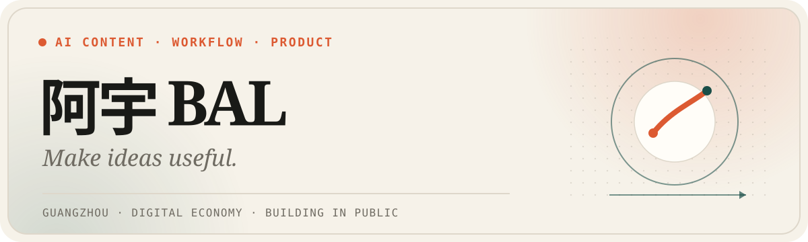

  

  <a href="https://ixuan.pw"><strong>个人网站</strong></a>
  &nbsp;·&nbsp;
  <a href="https://resume.ixuan.pw">在线简历</a>
  &nbsp;·&nbsp;
  <a href="mailto:472071312@qq.com">联系我</a>

## 你好，我是阿宇 BAL 👋

广州大学数字经济专业学生，专注 **AI 视频创作、AI 工作流和产品实践**。

我喜欢把模糊的想法拆成问题、方案、产品和结果，再根据真实反馈继续修改。从选题、脚本和分镜，到前端实现、自动化与交付，我更关心一件东西能不能真正被使用、复用和验证。

<table>
  <tr>
    <td align="center"><strong>42</strong> AI 剧情镜头完整交付</td>
    <td align="center"><strong>1K+</strong> 校园产品上线 3 日用户</td>
    <td align="center"><strong>10 天</strong> 电商 MVP 完整验证</td>
  </tr>
</table>

## Selected work

<table>
  <tr>
    <td width="50%" valign="top">
      
      <h3>今日副本工作室</h3>
      
把选题、剧情、旁白、分镜、生图、配音、字幕和剪映草稿连成一套可复用的 AI 视频生产流程。

      
<code>Python</code> <code>React</code> <code>AI Video</code> <code>Jianying</code>

      <a href="https://github.com/AayuBal/today-dungeon-studio">查看项目 →</a>
    </td>
    <td width="50%" valign="top">
      
      <h3>潮线之后 · Tide After</h3>
      
一款可直接游玩的单人海上木筏生存 Web 游戏，在昼夜与风暴之间打捞、建造、扩张和求生。

      
<code>React</code> <code>TypeScript</code> <code>Canvas</code> <code>SpacetimeDB</code>

      <a href="https://github.com/AayuBal/tide-after">查看项目 →</a>
    </td>
  </tr>
  <tr>
    <td width="50%" valign="top">
      
      <h3>白话 AI 小百科</h3>
      
给 AI 初学者的中文知识库，覆盖术语、模型、工具、职业方向与作品导向的学习路线。

      
<code>Next.js</code> <code>React</code> <code>TypeScript</code> <code>Knowledge Base</code>

      <a href="https://ai.ixuan.pw">打开网站 →</a> · <a href="https://github.com/AayuBal/baihua-ai-baike">查看源码 →</a>
    </td>
    <td width="50%" valign="top">
      
      <h3>Codex 斗地主</h3>
      
为 macOS Codex 增加一个本地单机斗地主入口，处理独立窗口、暂停恢复和本地资源加载。

      
<code>JavaScript</code> <code>Tauri</code> <code>macOS</code> <code>Codex</code>

      <a href="https://github.com/AayuBal/codex-doudizhu">查看项目 →</a> · <a href="https://github.com/AayuBal/codex-doudizhu/releases/tag/v1.0.0">下载 →</a>
    </td>
  </tr>
</table>

## Now building

- **AI 内容生产**：把选题、脚本、画面、声音和剪辑交付做成可检查、可复用的系统。
- **AI 工作流与自动化**：围绕真实业务，减少内容生产、知识整理与团队协作中的重复劳动。
- **产品从 0 到 1**：从用户问题和需求判断出发，推进到实现、上线、验证与复盘。

## Toolbox

`Product discovery` · `React` · `TypeScript` · `Python` · `Vite` · `Tailwind CSS` · `AI image / video` · `Jianying` · `Codex`

   
  项目之外，我也会旅行、散步、拍照，收集让生活重新变具体的瞬间。 
  <a href="https://ixuan.pw"><strong>在个人网站继续认识我 →</strong></a>

