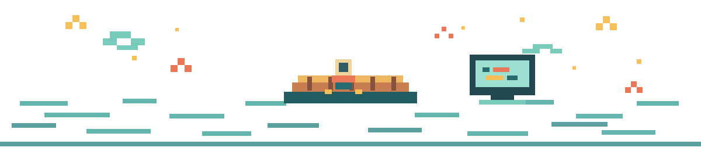
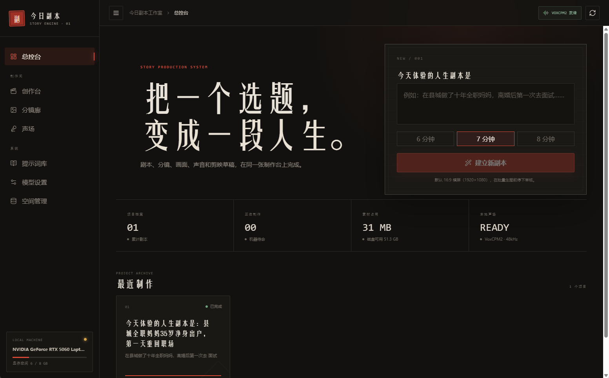
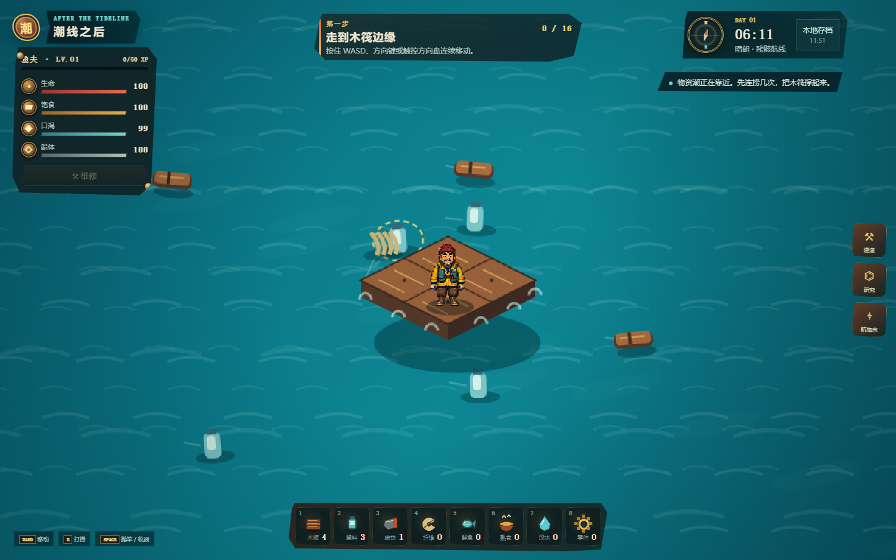
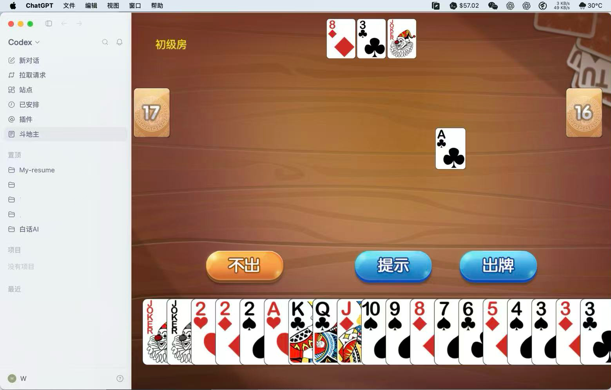

  
  <h1>阿宇 BAL</h1>
  
<strong>把想法做成能用、能玩的东西。</strong>

  
做 AI 工作流、开发者工具和互动产品，也喜欢像素游戏与各种小实验。

  

    <a href="https://ixuan.pw/#projects">🕹️ 逛逛我的作品集</a>
    &nbsp; · &nbsp;
    <a href="https://github.com/AayuBal?tab=repositories">🧰 翻翻所有仓库</a>
  

## 🧩 最近造的东西

<table>
  <tr>
    <td width="50%" valign="top">
      
      <h3>🎬 今日副本工作室</h3>
      
把选题、脚本、分镜、生图、配音和剪映草稿接成一条创作流程。

      
<code>Python</code> <code>React</code> <code>AI 视频</code>

    </td>
    <td width="50%" valign="top">
      
      <h3>🌊 潮线之后 · Tide After</h3>
      
在海上打捞、钓鱼和造东西，一点点扩展自己的像素木筏。

      
<code>TypeScript</code> <code>React</code> <code>Canvas</code>

    </td>
  </tr>
  <tr>
    <td width="50%" valign="top">
      
      <h3>📚 白话 AI 小百科</h3>
      
给 AI 初学者准备的中文知识库，从术语、工具一路逛到学习路线。

      
<code>Next.js</code> <code>React</code> <code>TypeScript</code>

    </td>
    <td width="50%" valign="top">
      
      <h3>🃏 Codex 斗地主</h3>
      
把一局本地单机斗地主，装进 Codex 的 macOS 独立窗口里。

      
<code>JavaScript</code> <code>Tauri</code> <code>macOS</code>

    </td>
  </tr>
</table>

## 🐍 像素贡献蛇

  <picture>
    <source media="(prefers-color-scheme: dark)" srcset="https://raw.githubusercontent.com/AayuBal/AayuBal/output/github-contribution-grid-snake-dark.gif" />
    <source media="(prefers-color-scheme: light)" srcset="https://raw.githubusercontent.com/AayuBal/AayuBal/output/github-contribution-grid-snake-light.gif" />
    
  </picture>

## 🧰 常用工具

`TypeScript` · `JavaScript` · `Python` · `React` · `Next.js` · `Vite` · `Tailwind CSS` · `Tauri`

  慢慢造，持续更新。下次路过，可能又多了个新玩具 ✨

